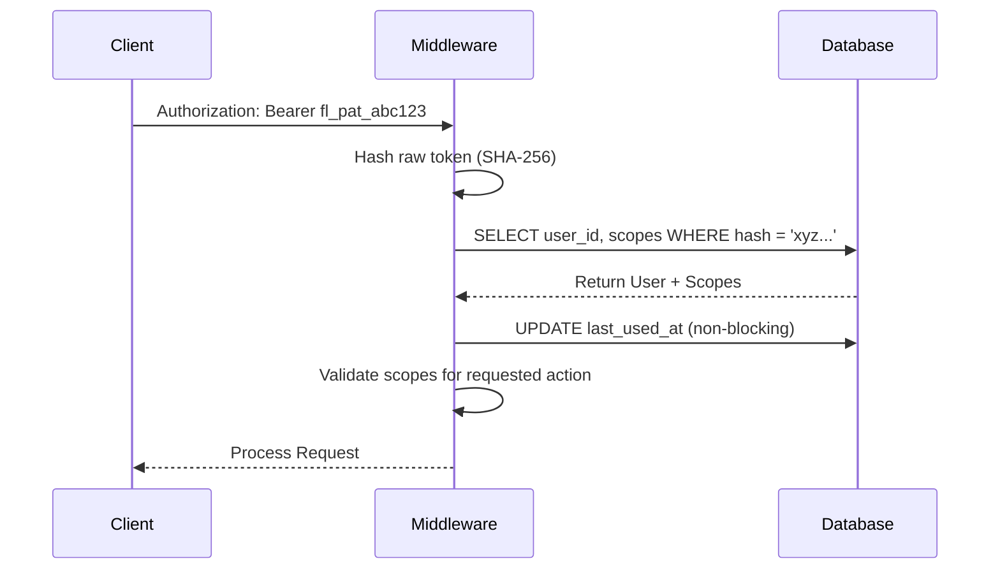

# Understanding API Key Logic for FlareCMS

This document analyzes the standard implementation of API Keys (Personal Access Tokens) for programmatic access to FlareCMS, ensuring security, performance, and clear scoping.

## 🔑 Token Architecture

Inspired by enterprise standards, FlareCMS tokens follow a **prefixed, non-reversible** pattern.

### 1. Token Format
Tokens use a distinct prefix for immediate identification (reducing accidental leaks and enabling secret scanning):
- `fl_pat_<base64url_string>` -> **Personal Access Token** (User-generated)
- `fl_oat_<base64url_string>` -> **OAuth Access Token** (System-generated)

### 2. The "Hash-Only" Storage Principle
Security is paramount. Raw tokens are **never** stored in the database.
- **Creation**: The server generates a high-entropy random string, hashes it using `SHA-256`, and stores only the hash.
- **Exposure**: The raw token is shown to the user **exactly once** upon creation.
- **Verification**: When a request arrives, the server hashes the provided token and performs a lookup against the `token_hash` column.

---

## 🏗️ Technical Workflow

### 1. Verification Logic

### 2. Permissions via Scopes
Access is not all-or-nothing. Tokens carry specific **scopes** that define what the programmatic client can do:
- `content:read`: Retrieve entries but not modify.
- `content:write`: Create or update entries.
- `media:upload`: Upload files.
- `schema:read`: Inspect collection structures.

---

## 📈 Planned Features for FlareCMS

Based on this logic, we will implement the following in FlareCMS:

1.  **Prefix Identification**: Use `fl_pat_` to make keys easily identifiable.
2.  **Optimized Metadata**: Store `prefix` (the first few characters), `last_used_at`, and `expires_at` for transparency.
3.  **Scoped Authorization**: Middleware that checks for the intersection of the User's Role and the Token's Scopes.
4.  **CLI Compatibility**: Enable the FlareCMS CLI to manage content using these tokens via the `FLARE_API_KEY` environment variable.

---

## 🛡️ Security Considerations

- **HMAC vs. Simple Hashing**: Using `SHA-256` for simple lookup is standard for high-performance API keys.
- **Non-blocking Post-Auth**: Updating `last_used_at` should be asynchronous (fire-and-forget) to avoid slowing down API responses.
- **Scope Clamping**: A token can never have more permissions than the user who created it. If a user is demoted, their tokens are automatically restricted.
